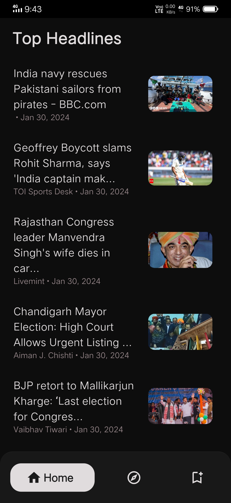
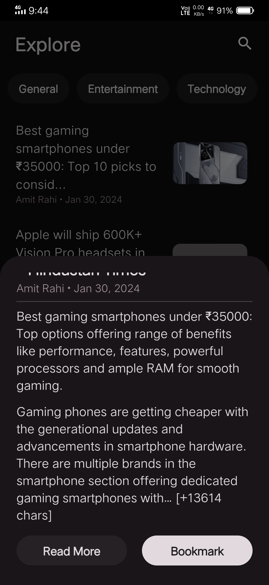
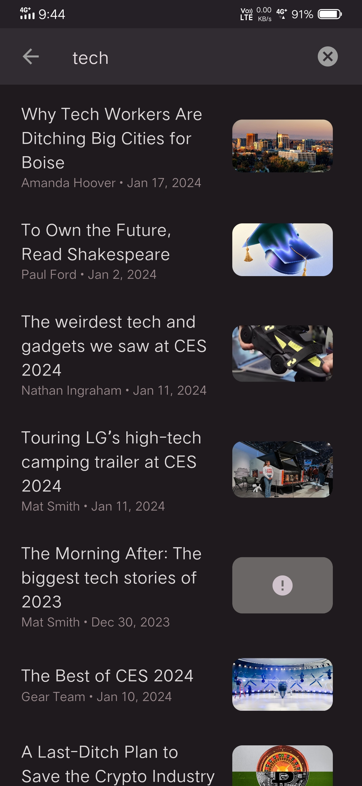
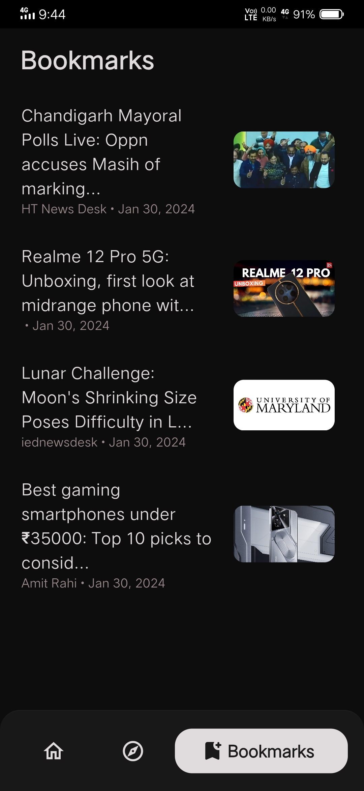

# NewsNest - Your All-in-One News Companion

## Overview

Welcome to NewsNest, the ultimate news app built with Flutter that offers a personalized and immersive news-reading experience. Stay informed, discover trending topics, and customize your news feed to match your interests, all in one intuitive app.

        

## Features

### Personalized Feeds
Tailor your news feed to match your interests and preferences. NewsNest learns from your reading habits to deliver a personalized news experience.

### Trending Topics
Stay ahead of the curve with our trending section. Discover the latest trends and hot topics, and join the conversation with just a tap.

        

### Multimedia Content
Immerse yourself in the news with vivid images, engaging videos, and interactive content. Experience news stories in a visually compelling way.

### Diverse Categories
Explore news across various categories such as Technology, Business, Sports, Entertainment, Health, and more. Easily navigate and discover stories that matter to you.

### Global Reach
NewsNest covers news from local to international levels, ensuring you're always connected to the world around you.

### Bookmark and Read Offline
Save your favorite articles for later with the bookmark feature. Enjoy the flexibility to read them offline, ensuring you never miss important stories.

        

## Technologies Used

- **Flutter**: The app is built using the Flutter framework for a seamless cross-platform experience.
  
- **Dart**: The programming language used to develop the application.

## Packages Used

- **http:** A package for making HTTP requests for fetching news content.

- **cached_network_image:** Caches images for a smoother and faster multimedia experience.

- **google_nav_bar:** Provides a customizable bottom navigation bar for easy navigation.

- **intl:** Internationalization and localization for handling date and time formats.

- **url_launcher:** Launches URLs in the default browser for external links.

- **shared_preferences:** A persistent key-value store for storing user preferences.

- **provider:** Implements state management using the Provider pattern.

## Project Structure

- **lib/**
  - **screens/**: Contains the main screens of the app.
  - **widgets/**: Reusable widgets used across different screens.
  - **models/**: Data models used in the app.
  - **providers/**: Implements state management providers.
  - **services/**: Backend services and API integrations.
  - **utils/**: Utility functions and helper classes.
  - **main.dart**: The entry point of the application.

## Getting Started

1. **Clone the repository**
   ```bash
   git clone https://github.com/YourUsername/NewsNest.git

2. **Navigate to the project directory**
   ```bash
   cd NewsNest
3. **Install dependencies**
   ```bash
   flutter pub get
4. **Run the app**
   ```bash
   flutter run

## API Reference

The news content in NewsNest is powered by the [NewsAPI](https://newsapi.org/). To use this app, you'll need to obtain an API key by signing up on their website. Once you have the API key, you can replace the placeholder in the app's code with your key for seamless news updates.

```dart
// Example: Add your NewsAPI key in the lib/backend/api/newsapi.dart file
const String apiKey = 'YOUR_NEWSAPI_KEY';
```
## Contributing

We welcome contributions from the community. If you find any bugs or have ideas for new features, please open an issue or submit a pull request.
